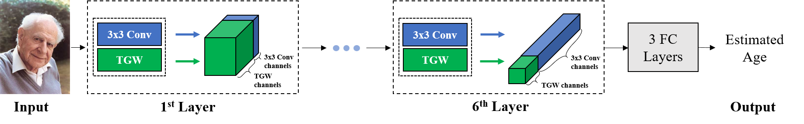

Trainable Gabor Wavelet
======================
This page provide source code of paper 
'Human Age Estimation Using Trainable Gabor Wavelet'  

## Requirements

### System
Our code requires following environment.
  1. Ubuntu 16.04 LTS
  2. **Cuda 8.0 or 9.0**
  3. **PyTorch 0.3.1**
  4. gcc >= 5.4.0

### Database
We used **aligned version of Adience database**.  
It is available at http://www.cslab.openu.ac.il/download/ 

## Installation

### Prepare Adience Database
We used same experimental settings as in [1].  
It can be reproduced with following steps.
  1. Download aligned version of Adience dataset (aligned.tar)
  2. Put and **extract 'aligned.tar'** in tgw/data/aligned
  3. Execute **'make_adience_data.py'**

### Build Cuda Kernels 
To speed up training, we implemented forward and backward pass of TGW in
Cuda kernels.  
Build process is given below.
  1. Set appropriate **'nvcc' path in 'Makefile'**  
    (You need to check '/usr/local/cuda/bin/nvcc' in
      'NVCC_COMPILE := /usr/local/cuda/bin/nvcc -c -o')
  2. Set appropriate **cuda library path in 'build_ffi.py'**  
    (You need to check '/usr/local/cuda/lib64/*.a' in 
      'extra_objects += glob.glob('/usr/local/cuda/lib64/\*.a')')
  3. Execute **'build.sh'**

## How to Test?

### Download pre-trained models.
We provide pre-trained model of the proposed network.  
It is available at **[Saved_Models](https://drive.google.com/file/d/16JlE5IaNU2fE8Otl-OHk8jQHgjEDVFhe/view?usp=sharing)**.  
After download, **move all files into 'tgw/saved_models'**.

### Run Test Script
Run **'test.py'**.  
Test results will be stored at 'tgw/log'.  
Our result on each fold is summarized in following table.  

|Test Fold   | 0   | 1   | 2   | 3   | 4    |
|---         |---  |---  |---  |---  |---   |
|**Accuracy**|62.11|49.35|56.86|49.71| 53.92|

## How to Train?
Training of proposed network requires 2 mandatory settings and
support other options for training.

### Type (Mandatory)
Type of Operation mode of proposed network 
  set by giving argument to **'-t'** options.  
It has following 4 different modes.
  1. **ksize**: learns sampling grid (**Best Method**)  
  2. **all**: learns sampling grids and parameters of Gabor wavelets  
  3. **~ksize**: learns other parameters of Gabor wavelets except orientation  
  4. **none**: do not learn any parameter of Gabor wavelets w/ steering.

### Fold (Mandatory)
Fold of training should be given to training script.  
You need to specify the number of fold in [0, 1, 2, 3, 4] with **'-f'** option.

### Resume (Optional)
Resume of training from stopped epoch with **--resume**

### GPU Number (Optional)
You can specify the number of GPU can be used for training with **--gpu**. 

### Examples
If you want to train the proposed network with trainable sampling grid
for 1st fold of Adience dataset then you need to put into following bash
command.
> python train.py -t ksize -f 1  

If you want to resume from an existing checkpoints,   
> python train.py -t ksize -f 1 --resume  

If you want to resume from existing checkpoints from GPU with GPUID 2,   
> python train.py --gpu 2 -t ksize -f 1 --resume  

****
## References
[1] Levi, Gil, and Tal Hassner. 
"Age and gender classification using convolutional neural networks." 
Proceedings of 
  the IEEE Conference on Computer Vision and Pattern Recognition Workshops. 
  2015.